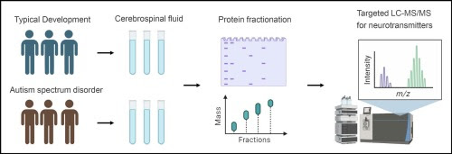

# Escritura

Durante una investigación **la escritura será algo primordial**. Ojo, el trabajo escrito toma una buena cantidad de **tiempo**. Por qué? Porque hay varias iteraciones dónde escribes, te hago sugerencias, realizas cambias, me lo mandas de vuelta, te hago nuevas sugerencias, y así sucesivamente.

Escribir es un proceso complejo dónde uno necesita organizar y estructurar ideas. Siempre debes pensar en el **mensaje** que quieres transmitir. Además, - y esto es bastante difícil en general - debes **abstraerte de lo que sabes**. Debes escribir pensando en lo que **otra persona** va a leer y va a entender de lo que estás escribiendo.

Una buena técnica para saber si algo está bien escrito es leerlo en voz alta. Si algo te hace ruido, revísalo.

## La pregunta guía

La **pregunta de investigación** es lo más esencial de tu tesis, el resto son detalles.
La mayoría de la veces que tengamos una reunión voy a partir preguntándote cuál es tu pregunta de investigación.

Los datos son sólo eso, **datos**. Lo que hace unx investigadorx es convertir - a través de un análisis de datos - una masa amorfa de información (datos crudos) en algo que tenga **sentido**. Esto significa describir e interpretar esos resultados. 

El objetivo final de una investigación científica es convertir los **datos** que recolectamos en información que nos sirva para **comprender** algo que pasa en el mundo y que nos interesa entender. Los datos en sí no importan, lo que importa es lo que nosotrxs interpretemos. Y lo que nosotrxs interpretemos depende netamente de los antecedentes que tengamos. Por ello, es muy muy importante que te sumergas en tu tema y te vuelvas unx expertx en ello.

Para que nos sirve el conocimiento? Nos puede servir para entender cómo funciona algo (ej: un mecanismo) y para aplicarlo en cosas importantes de nuestra vida (ej: una terapia).

Siempre es bueno que te hagas una imagen mental de tu pregunta de investigación. Y para ello ayuda que te hagas un dibujo o un esquema de tu investigación: un mono.

Hacer un mono es muy útil para plasmar y trabajar las preguntas de investigación. El **mono** puede tomar cualquier forma pero tiene que ayudarte a **transmitir una idea**. Además, será muy útil cuando tengas que hacer la presentación de tu tesis.

Qué intuyes de los siguientes monos?

```{r, echo=FALSE, out.width='30%', fig.align='center', fig.cap=NULL}
knitr::include_graphics('images/paper_1_schema.jpg')
```

<p align="center">********</p>

```{r, echo=FALSE, out.width='60%', fig.align='center', fig.cap=NULL}
knitr::include_graphics('images/paper_2_schema.jpg')
```

<p align="center">********</p>

```{r, echo=FALSE, out.width='70%', fig.align='center', fig.cap=NULL}

```

<p align="center">********</p>

## El outline

El outline es una de las herramientas más poderosa que tendrás jamás. Antes de ponerte a escribir **cualquier cosa** piensa en hacer un **outline**. 

Un outline (o esquema) es una especie de lista de ideas, una estructura organizada que detalla los puntos principales y las ideas secundarias de un documento antes de que se escriba un texto completo. Sirve como un mapa que guía el proceso de escritura, asegurando que todas las partes necesarias del tema estén cubiertas de manera lógica y coherente. 

Un outline es importante por varias razones:

- Permite **organizar** las ideas de manera clara y estructurada. Esto ayuda a visualizar cómo se conectan los diferentes puntos y asegura que el argumento fluya de manera lógica. Sin un esquema, es fácil perderse en los detalles y desviarse del tema principal.

- Agrega **claridad** a tu escrito. Es decir, ayuda a mantener el enfoque en los **puntos clave** que se quieren tratar, evitando la inclusión de **información irrelevante**. Esto es especialmente útil cuando se trabaja con temas complejos que pueden fácilmente salirse de control sin una guía clara.

- **Facilita** el proceso de escritura al proporcionar una **hoja de ruta** que guía la creación del contenido. Con un outline, es más fácil empezar a escribir y seguir avanzando sin perder tiempo pensando qué viene después. Además, **reduce la necesidad de grandes revisiones**, ya que el texto sigue una estructura predefinida. 

- Hace que sea más fácil **revisar** y **ajustar** la estructura antes de invertir mucho tiempo en la redacción completa. También es útil cuando se trabaja en equipo, ya que todos los miembros pueden estar de acuerdo en la estructura básica y el contenido antes de comenzar a escribir. Antes que vayas a los detalles de cada punto debes tener clara una idea general de lo que quieres contar. Cuando yo revise me permite ver si tu texto tiene esa coherencia. Me permite ver si estas entregando bien tu mensaje.

Por ejemplo. Mira el siguiente texto sobre el rol de las emociones en la toma de decisiones.

*Las emociones son respuestas complejas que combinan experiencias subjetivas, reacciones fisiológicas y expresiones conductuales. Las emociones nos ayudan a adaptarnos, responder al entorno e influyen en una variedad de funciones.*

*Las emociones juegan un papel importante en la toma de decisiones. Las teorías tradicionales de la decisión, como la teoría de la utilidad esperada, asumían que las personas son agentes racionales que evalúan todas las opciones y eligen la que maximiza su beneficio esperado. Sin embargo, investigaciones más recientes en psicología y neurociencia han demostrado que las emociones actuan como señales rápidas e intuitivas que nos guían cuando enfrentamos decisiones complejas o bajo incertidumbre.*

*Las emociones también pueden influir en la toma de decisiones a través de un fenómeno conocido como el “sesgo afectivo”. Este sesgo se refiere a la tendencia de las personas a permitir que sus estados emocionales actuales afecten sus juicios y elecciones. Las emociones positivas pueden fomentar un pensamiento más creativo y expansivo, mientras que las emociones negativas pueden llevar a un pensamiento más analítico y cuidadoso.*

*La influencia de las emociones en la toma de decisiones no se limita a las respuestas inmediatas. Las experiencias emocionales pasadas también pueden moldear nuestras preferencias y comportamientos futuros. Por ejemplo, una experiencia negativa significativa, como una pérdida financiera, puede crear una aversión duradera al riesgo. De manera similar, una experiencia positiva puede aumentar la disposición a repetir comportamientos que anteriormente resultaron en recompensas. Este aprendizaje emocional se almacena en la memoria y puede ser activado automáticamente cuando enfrentamos situaciones similares en el futuro, guiando nuestras decisiones de manera implícita.*

*La interacción entre emociones y toma de decisiones tiene implicaciones importantes en diversos campos. En economía, comprender cómo las emociones influyen en las decisiones financieras puede ayudar a diseñar mejores políticas y productos que consideren el bienestar emocional de las personas. En medicina, los profesionales de la salud pueden utilizar el conocimiento sobre la toma de decisiones emocional para mejorar la comunicación con los pacientes y apoyarles en la toma de decisiones informadas sobre su salud. Por último, en política, los líderes pueden utilizar las emociones para movilizar a los votantes y fomentar el apoyo a políticas específicas.*

Más allá del contenido fíjate que hay **ideas específicas** que se mencionan y se desarrollan en los párrafos. Esas ideas específicas constituyen el outline.
El outline de este texto podría ser el siguiente:

- Qué son las emociones
- Toma de decisiones y la teoría tradicional 
- Efecto de las emociones en la toma de decisiones
- Cómo influyen las emociones en la toma de decisiones
- Influencia a corto plazo (sesgo afectivo)
- Influencia a largo plazo
- Implicaciones 

`r knitr::asis_output("\U0001F4A1")` <span style="color:green">**Antes de ponerte a escribir cualquier cosa** piensa en hacer un **outline**. Teniendo clara tu *idea general* y teniendo claro como cada una de las ideas específicas que quieres transmitir *se conectan*, será mucho mas fácil para ti escribir después.</span>

## El outline inverso

Un **outline inverso** significa armar un outline después que ya has escrito. Permite planificar y revisar textos a través de la elaboración de un esquema o estructura de lo que ya está escrito (en lugar de hacer un esquema antes de que escribas). Básicamente, revisas el texto y tomas nota de la idea principal de cada sección, párrafo o apartado, creando un “mapa” o esquema de su contenido. Este proceso permite identificar si el texto sigue una estructura lógica y es coherente.

El outline inverso es útil para:

- **Revisar la coherencia y cohesión**: Permite ver de manera objetiva si las ideas fluyen de forma lógica y si el desarrollo es claro.

- **Detectar redundancias o temas ausentes**: Al analizar la estructura real del texto, es más fácil identificar información repetida o temas que faltan.

- **Optimizar el orden de las ideas**: Al visualizar el contenido en forma de esquema, es más fácil reordenar secciones o párrafos para mejorar la progresión y claridad.

- **Evaluar el enfoque**: Ayuda a confirmar si cada sección o párrafo contribuye a los objetivos y argumentos centrales del documento.

Para un **manuscrito académico**, como un artículo o tesis, el outline inverso es especialmente valioso en la etapa de revisión. Ayuda a:

- **Verificar la alineación con el objetivo de investigación**: Permite confirmar que cada sección, desde la introducción hasta la discusión, contribuye directamente a la pregunta o hipótesis central.

- **Asegurar una estructura lógica en la argumentación**: En un paper, el outline inverso puede mostrar si los resultados y las discusiones se conectan bien con la literatura previa y si la interpretación de los resultados sigue un orden lógico.

- **Refinar la organización de las ideas**: Por ejemplo, en una tesis, que suele ser extensa y compleja, el outline inverso ayuda a dividir el contenido en bloques manejables y a reorganizar partes que podrían ser más efectivas en otra posición.

- **Facilitar la edición y la precisión**: Una vez hecho el outline, es más fácil trabajar en cada sección para mejorar la claridad, eliminar información innecesaria y asegurarse de que los argumentos sean precisos y concisos.

*Cuando haces un outline inverso?*
Típicamente cuando ya has escrito mucho (has tomado notado de ciertas ideas, has desarrollado resumenes de los papers que has leído, etc) y quieres revisar si lo que has escrito tiene un hilo conductor.

Imagina que escribiste el siguiente texto:

*La interacción entre emociones y toma de decisiones tiene implicaciones importantes en diversos campos. En economía, comprender cómo las emociones influyen en las decisiones financieras puede ayudar a diseñar mejores políticas y productos que consideren el bienestar emocional de las personas. En medicina, los profesionales de la salud pueden utilizar el conocimiento sobre la toma de decisiones emocional para mejorar la comunicación con los pacientes y apoyarles en la toma de decisiones informadas sobre su salud. Por último, en política, los líderes pueden utilizar las emociones para movilizar a los votantes y fomentar el apoyo a políticas específicas.*

*Las emociones pueden influir en la toma de decisiones a través de un fenómeno conocido como el “sesgo afectivo”. Este sesgo se refiere a la tendencia de las personas a permitir que sus estados emocionales actuales afecten sus juicios y elecciones. Las emociones positivas pueden fomentar un pensamiento más creativo y expansivo, mientras que las emociones negativas pueden llevar a un pensamiento más analítico y cuidadoso.*

*Las emociones son respuestas complejas que combinan experiencias subjetivas, reacciones fisiológicas y expresiones conductuales. Las emociones nos ayudan a adaptarnos, responder al entorno e influyen en una variedad de funciones, entre ellas la toma de decisiones.*

*Las emociones juegan un papel importante en la toma de decisiones. Las teorías tradicionales de la decisión, como la teoría de la utilidad esperada, asumían que las personas son agentes racionales que evalúan todas las opciones y eligen la que maximiza su beneficio esperado.*

*Investigaciones recientes en psicología y neurociencia han demostrado que las emociones actuan como señales rápidas e intuitivas que nos guían cuando enfrentamos decisiones complejas o bajo incertidumbre.*

*Las experiencias emocionales pasadas también pueden moldear nuestras preferencias y comportamientos futuros. Por ejemplo, una experiencia negativa significativa, como una pérdida financiera, puede crear una aversión duradera al riesgo. De manera similar, una experiencia positiva puede aumentar la disposición a repetir comportamientos que anteriormente resultaron en recompensas. Este aprendizaje emocional se almacena en la memoria y puede ser activado automáticamente cuando enfrentamos situaciones similares en el futuro, guiando nuestras decisiones de manera implícita.*

El outline inverso de este texto podría ser el siguiente:

- Implicaciones de la influencia de las emociones en la toma de decisiones 
- Influencia de las emociones a corto plazo 
- Qué son las emociones
- Toma de decisiones y la teoría tradicional
- Efecto de las emociones en la toma de decisiones
- Influencia de las emociones a largo plazo

Haciendo esto te das cuenta que hay un problema en la forma que organizaste tus ideas.

## Google docs

En general el trabajo de escritura se hará vía documentos word de Google (Google docs). Y se realizará de la siguiente manera: 

- Cada documento que tu crees debe llevar un **nombre**. Por ejemplo, **anteproyecto_v1**.
- Una vez que trabajes en el documento me avisas por correo para que yo haga una revisión.
- Voy a hacer comentarios en forma de "sugerencias". Es decir, son cambios que tu puedes o no aceptar. Si tienes dudas sobre los cambios lo podemos discutir (puedes mandarme un correo para hacerme la consulta o lo podemos conversar en una reunión). Una vez que yo termine de revisar y hacer mis comentarios te avisaré  (vía email).
- Cuando vayas a ver el documento, antes de hacer nada debes crear una **copia** de este documento. Mira este <a href="https://www.youtube.com/watch?v=I9QD49xBPS0" target="_blank">video</a>. Si la versión que yo trabajé es la v1, entonces debes crear la v2 (y así sucesivamente). El nombre del archivo quedará como **anteproyecto_v2**.
- Una vez que termines de trabajar en el documento debes avisarme (vía email) para que yo lo revisé. Y así sucesivamente.

`r knitr::asis_output("\U0001F4A1")` <span style="color:green">**¿Por qué es importante que haya distintas versiones?:** Porque de esa forma puedes ir fijándote qué cosas comúnenmente deben ser corregidas. Además, pueden haber cosas que en el momento actual no te sirven, pero que se podrían usar en el futuro.</span>

Es importante que para todos los archivos que trabajes le pongas **nombres informativos**. Y si hay varias iteraciones entonces debes ponerle un **número de versión**. Evita los **acentos** en los nombres de los archivos y los documentos (a los computadores no les gusta). Por último, puedes agregar o no un guión bajo (_). Esto ayuda a que un nombre sea mas leíble. Es más fácil leer anteproyecto_v1 que anteproyectov1.

## Resúmenes

Para escribir debes leer. **Pero no te confíes de tu memoria**. Tienes que ser estratégicx acerca de como extraes la información que necesitas. Por ello debes buscar una manera de hacer **resúmenes** que sean **útiles**. Un buen resumen **no es una copia de todos los detalles de un artículo**. Un resumen toma lo **esencial** de un artículo. Y la **extensión** que le des a un resúmen depende de un **objetivo** que debes definir de antemano.

Existen varios **tipos** de resúmenes dependiendo del objetivo específico que buscas al escribirlos. La información que se incluye y la extensión del resumen varían según el propósito. Algunos ejemplos de tipos de resúmenes son:

- <span style="color:red">**Resumen básico:**</span> En este resumen haces una descripción general del contenido del artículo, incluyendo los objetivos, metodología y resultados principales.

- <span style="color:red">**Resumen metodológico:**</span> Además de lo anterior, detallas los métodos. Si el estudio presentado en el artículo es parecido o se relaciona en algo con tu proyecto te permite comprender como se podrían hacer algunos análisis.

- <span style="color:red">**Resumen con enfoque teórico:**</span> Es un resumen que puede usarse para ir hilando la descripción de tu marco téorico. No requiere que des muchos detalles. En general, apunta a algo bien específico. Incluye un análisis y evaluación del artículo, considerando sus fortalezas, limitaciones y contribución al campo de estudio. Requiere un pensamiento profundo. Pero, es más breve que los otros resúmenes.

La **extensión** del resumen depende de un objetivo particular.
Imagina que estoy escribiendo el marco teórico sobre los efectos de las condiciones sociales de las personas en ciertas funciones cognitivas. Leí un paper ("Socioeconomic status and self–other processing: socioeconomic status predicts interference in the automatic imitation task" de Farwaha & Obhi 2020, míralo <a href="https://pubmed.ncbi.nlm.nih.gov/32130430/" target="_blank">acá</a>) que reporta que el estatus socioeconómico podría hacer que las personas perciban las acciones de los demás de distintas forma. Un resumen muy breve de alrededor de 20 palabras captura la idea teórica central que quiero transmitir:

- *Personas con alto estatus socioeconómico son menos susceptibles a las acciones de otros que las personas con bajo estatus socioeconómico.*

Dependiendo de lo que quiera transmitir basta con eso. Por otro lado, si quiero enfatizar este estudio por alguna razón (por ejemplo podría utilizar la misma metodología para medir la respuesta a las acciones de otros) podría hacer un resumen más extenso de 100-200 palabras que permite incluir detalles adicionales importantes, como la metodología y los análisis específicos. 

- *Se ha propuesto que personas con alto estatus socioeconómico pueden ser menos sensibles a las acciones de otros. Se usó una tarea de imitación automática para comparar el desempeño de personas con alto y bajo estatus socioeconómico. En la tarea de imitación automática los participantes deben responder a números presentados en la pantalla de un computador. Al mismo tiempo que responden al número observan incidentalmente el movimiento congruente o incongruente de una mano. La diferencia en los tiempos de reacción (o errores) entre respuestas congruentes e incongruentes (efecto de congruencia) es un índice de procesamiento yo/otro e indica la capacidad para inhibir una respuesta de imitación. Así, un valor más bajo en el efecto de congruencia indica que las acciones de un participante son menos afectadas por las acciones que uno observa. En este estudio se observó que las personas con alto (con respecto a bajo) estatus socioeconómico tienen un menor efecto de congruencia. Estos resultados sugieren que las personas con alto (con respecto a bajo) estatus socioeconómico son menos susceptibles a las acciones de otros*.

La cantidad de detalle dependerá de si cierta información ya se ha mencionado previamente en el documento. Fíjate que en el resumen previo trato de explicar en detalle el paradigma experimental. Si quiero usar el resumen para agregarlo en un documento dónde **ya explique** este paradigma en alguna parte del documento, entonces este resumen podría ser mas corto (~ 100 palabras):

- *Se ha propuesto que personas con alto estatus socioeconómico pueden ser menos sensibles a las acciones de otros. Se usó una tarea de imitación automática para comparar el efecto de congruencia entre personas con alto y bajo estatus socioeconómico. Se observó que las personas con alto (con respecto a bajo) estatus socioeconómico tienen un menor efecto de congruencia, es decir, fueron menos afectadas por las acciones que observaron en el computador. Estos resultados sugieren que las personas con alto (con respecto a bajo) estatus socioeconómico son menos susceptibles a las acciones de otros*.

`r knitr::asis_output("\U0001F4A1")` <span style="color:green">Recuerda, al escribir el resumen de un artículo de investigación es fundamental considerar el propósito de ese resumen para determinar qué tipo de resumen es más apropiado y cuánto detalle incluir. El objetivo es capturar la esencia del estudio de manera concisa y efectiva.</span>

`r knitr::asis_output("\U0001F98A")` <span style="color:red">Importante: Los resumenes se deben ubicar en un archivo de texto en la subcarpeta "Biblio". Por cada paper habrá un archivo de texto con el mismo nombre del paper y que incluirá un resumen del paper.</span>

## Gestor de referencias

Típicamente en la tesis (y en los artículos de investigación) se deben **citar** y **referenciar** al final de un manuscrito las fuentes desde donde sacamos información (comúnmente otro artículos científicos, pero se pueden incluir libros y páginas web). La idea es que cuando cites y hagas tu sección de referencias en un manuscrito lo hagas de forma **automática**. No te aprendas de memoria como citar en formato APA. **No sirve de nada!**. Es una perdida de tiempo y es una perdida de espacio en tu cabeza. El trabajo de gestión de las referencias la debe hacer una **máquina**, no tú. Tu trabajo es pensar y desarrollar ideas.

Revisa el siguiente video (<a href="https://www.youtube.com/watch?v=cOweYm7oaZI" target="_blank">aquí</a>) y aprende como usar Zotero. Es bueno, bonito y gratis. Si tienes dudas, **pregúntame**.

## Uso de la IA
Puedes usar inteligencia artificial (IA)? Claro que puedes, pero debes hacerlo con cautela y con responsabilidad. La transparencia implica que indiques claramente cómo has utilizado la IA en tu trabajo. Es fundamental utilizar la IA como un **complemento** y siempre **verificar la información** generada para asegurar su fiabilidad y veracidad. Además, debes asumir la **responsabilidad total** del contenido generado, incluso si has utilizado IA para crear parte del material. Para ello debes revisar y validar concienzudamente su contenido.

Hay varias herramientas de IA que te pueden ser útiles. No voy a poner una lista pero seguramente estas al corriente de ChatGPT u otros.

Para usar la IA debes hacer preguntas estratégicas. Mientras más detalles pongas en tus preguntas más detalles vas a obtener.
Por ejemplo, para resumir un artículo antes de leerlo puedes escribir. Puedes usar el siguiente prompt:

*Resume el siguiente artículo. Mi objetivo es entender los puntos principales antes de leer el texto completo.*

Y pegas el texto.

También puedes revisar algún texto en términos de ortografía, redacción y coherencia. Puedes usar el siguiente prompt: 

*Revisa y corrige el siguiente párrafo para mejorar la gramática y el estilo: [texto].*

Y pegas el texto.

Atención. El hecho que te ayudes de la IA para anticipar lo que vas a leer no te exime de leer los artículos. Tienes que verlo como una ayuda. 

